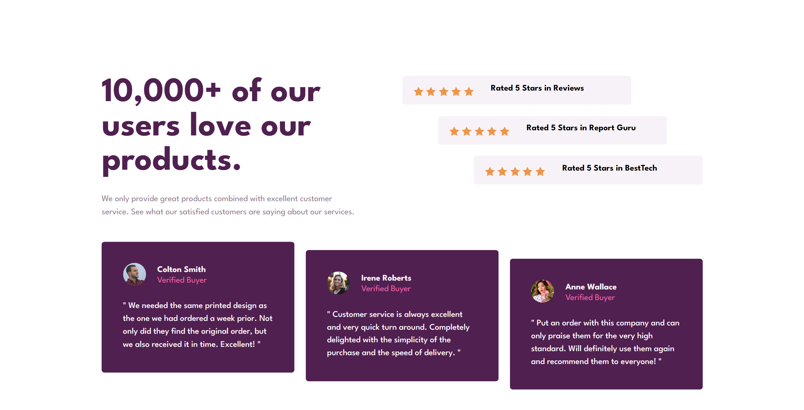

# Frontend Mentor - [project name]

This is a solution to the [[project name] challenge on Frontend Mentor](https://www.frontendmentor.io/challenges/3column-preview-card-component-pH92eAR2-). Frontend Mentor challenges help you improve your coding skills by building realistic projects.

### Difficulty: `newbie`

## Table of contents

- [Overview](#overview)
  - [The challenge](#the-challenge)
  - [Useful resources](#useful-resources)
    - [Author](#author)

## Overview

### The challenge

To build the [project name] according to the given designs as close as possible.
The users should be able to:
- View the optimal layout depending on their device's screen size
- See hover states for interactive elements

### Useful resources

#### Author

- LinkedIn - [Yari Morcus](https://www.linkedin.com/in/yarimorcus)
- Frontend Mentor - [@YariMorcus](https://www.frontendmentor.io/profile/YariMorcus)